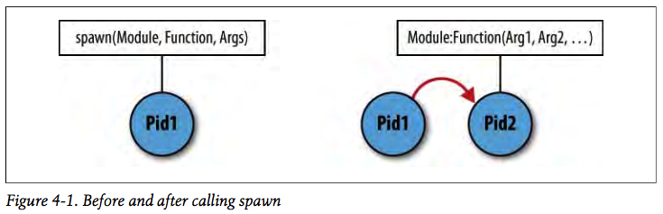
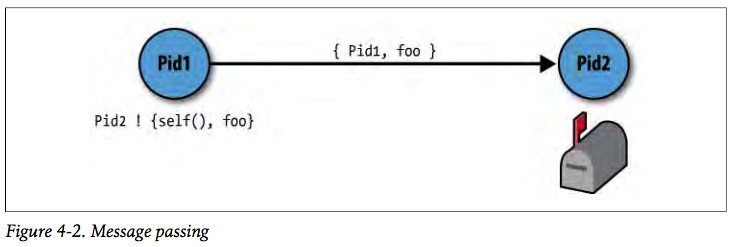

# Chapter 4

Concurrent Programming

---

### Concurrent programming
* **Concurrency** is the ability for different functions to execute in parallel without affecting each other.
* **Process** is the concurrent activity in Erlang.
* **Message Passing** is only way for processes to interact with each other.

---


> The world is concurrent.
Things in the world don't share data.
Things communicate with messages.

*Joe Armstrong*

---

### Subjects
* Creating Processes
* Message Passing
* Receiving Messages
* Registered Processes
* Timeouts
* Benchmarking
* Process Skeletons
* Tail Recursion and Memory Leaks
* A Case Study on Concurrent Oriented Programming
* Race Conditions, Deadlocks, and Processes Starvation
* The Process Manager

---

### Creating Processes
```erlang
Pid2 = spawn(Module, Function, Args).
```


---

#### Spanning a process
```erlang
1> spawn(no_module, nonexisting_function, []).
<0.65.0>
2>
=ERROR REPORT==== 28-Jul-2017::09:01:39 ===
Error in process <0.65.0> with exit value:
{undef,[{no_module,nonexisting_function,[],[]}]}
```

---

#### List all runnig processes
```erlang
1> processes().
[<0.0.0>,<0.1.0>,<0.4.0>,<0.30.0>,<0.31.0>,<0.33.0>,
 <0.34.0>,<0.35.0>,<0.36.0>,<0.38.0>,<0.39.0>,<0.40.0>,
 <0.41.0>,<0.42.0>,<0.43.0>,<0.44.0>,<0.45.0>,<0.46.0>,
 <0.47.0>,<0.48.0>,<0.49.0>,<0.50.0>,<0.51.0>,<0.52.0>,
 <0.53.0>,<0.63.0>]
2>
```

---

#### Find out what they are doing
```erlang
 2> i().
Pid               Initial Call             Heap    Reds Msgs
Registered        Current Function        Stack
<0.0.0>           otp_ring0:start/2         610     974    0
init              init:loop/1                 2
<0.1.0>           erts_code_purger:start/0  233       4    0
erts_code_purger  erts_code_purger:loop/0     3
<0.4.0>           erlang:apply/2           4185  124855    0
:
```

---

### Message Passing


* Processes communicate with each other using message passing.
* Each Erlang process has a `mailbox` in which incoming messages are stored.

---

#### Sending messages to the shell
```erlang
1> Pid = self().
<0.63.0>
2> Pid ! hello.
hello
3> flush().
Shell got hello
ok
4> <0.63.0> ! hello.
* 1: syntax error before: '<'
5> Pid2 = pid(0,63,0).
<0.63.0>
6> Pid2 ! hello.
hello
7> flush().
Shell got hello
ok
```

---

#### Making the shell crash
```erlang
1> self().
<0.63.0>
2> 1/0.
** exception error: an error occurred when evaluating an arithmetic expression
     in operator  '/'/2
        called as 1 / 0
3> self().
<0.79.0>
4> pid(0,63,0) ! hello.
hello
5> flush().
ok
```

---
